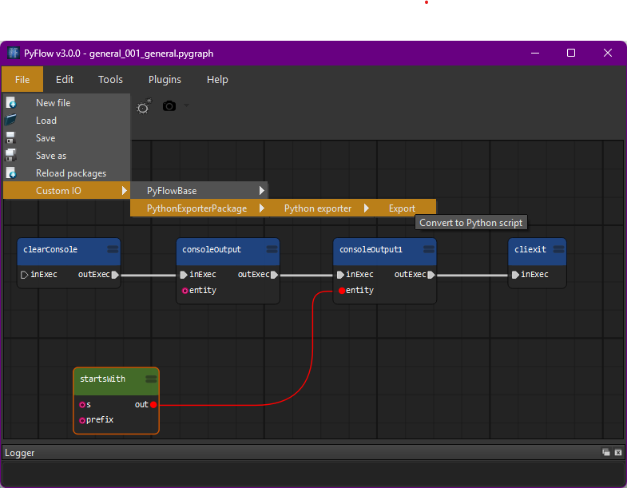
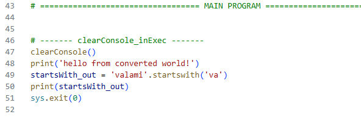

# PythonExporter for PyFlow

## Overview

This is an extension package for https://github.com/pedroCabrera/PyFlow.
PyFlow is a general purpose visual scripting framework for python.

The aim of this project is to export the PyFlow graphs to runnable pure
Python scripts. So with a single click like this:

You should get an output like this:

The generated scripts should run without the need of the PyFlow library

## Approach

Since each node in PyFlow has to be developed, I chose to not try to
figure out the neccessary Python code from that. The node developer is
familiar with Python coding and some PyFlow concepts anyway.

So this package needs each node to have its own conversion function,
which should be developed by the node developer. However I include
converters for the PyFlowBase package nodes.

## Status & Contribution

Currently this project is in a *proof-of-concept* state, not ready for
production use. The next planned major milestone is to have all nodes
in the PyFlowBase package covered and have lots of test graphs for them.

I accept contributions as issue reports, code contributions through PRs,
even ideas how to go further from here.

## Install

When you have PyFlow set up, you can download this package from github
and put it in a folder which then you set up as *additional packages*
folder in PyFlow preferences.

## Development

Clone the repo and before doing any work, don't forget to change the
path of PyFlow in pytest.ini, .vscode/settings.json, .vscode/launch.json
